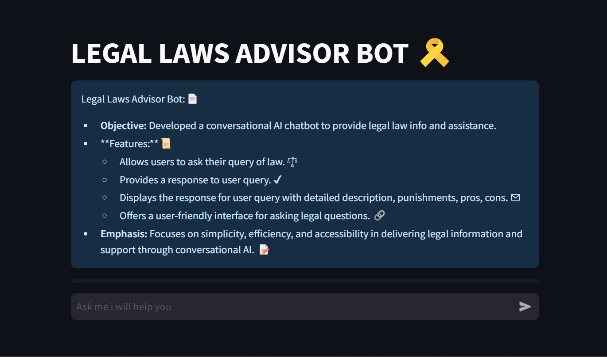

# LEGAL LAWS ADVISOR BOT

## Overview
The project is a Legal Laws Advisor Bot built using Streamlit, aimed at providing legal information and assistance through a conversational interface. Here’s an overview of the project:

Key Features:
User Query Handling:

Users can input legal queries into the chatbot interface.
The bot responds by providing detailed legal information such as punishments, pros, cons, and relevant sections from the Indian Penal Code (IPC).

- Pattern Matching:
The bot uses predefined patterns from a JSON file that contains common legal topics 
It matches user queries with these patterns to generate relevant responses.

- Chat Interface:
A chat-like interface displays a history of messages between the user and the bot.
It shows both the user’s query and the bot’s response in a structured format, creating an intuitive user experience.

The bot is designed for easy interaction, focusing on simplicity and efficiency in delivering legal information.
It helps users access complex legal knowledge quickly, making it useful for general queries about law.
Code Flow.

User input is matched with a set of predefined legal patterns loaded from a JSON file.
If a match is found, the corresponding legal response is shown to the user.
# Reference

# Features
- Allows users to ask their query of law. 𓍝
- Provides a response to user query. ✔
- Displays the response for user query with detailed description, punishments, pros, cons. ✉︎
- Offers a user-friendly interface for asking legal questions. 🔗

## Contact
For any inquiries or feedback, please contact [VINAY REDDY] at [kunduvinayredde@gmail.com].
